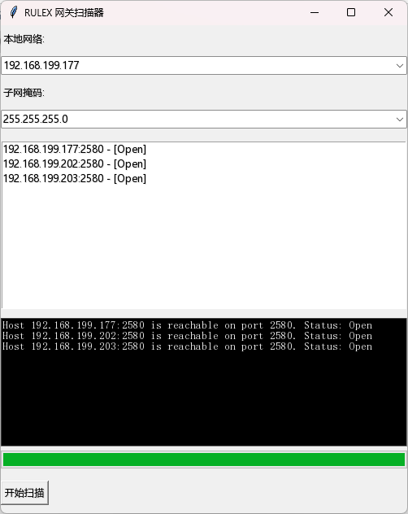

# rhino-scanner

犀牛系列设备扫描器, 这个软件是Chatgpt帮忙写的！注意IP范围和子网掩码不要输错了。

## 下载
这里已经打包好了一个exe：https://github.com/hootrhino/rhino-scanner/dist 。其他系统没试过，应该是可以跨平台的。

## 搭建环境
开发环境用python3.11，注意环境安装正确。
```sh
python3.11 -m venv venv
pip3 install -r ./deps.txt
```
## Build
```sh
pyinstaller --noconsole --onefile --name RhinoScanner rhino-scanner.py
```
编译好的在 `dits` 目录下。